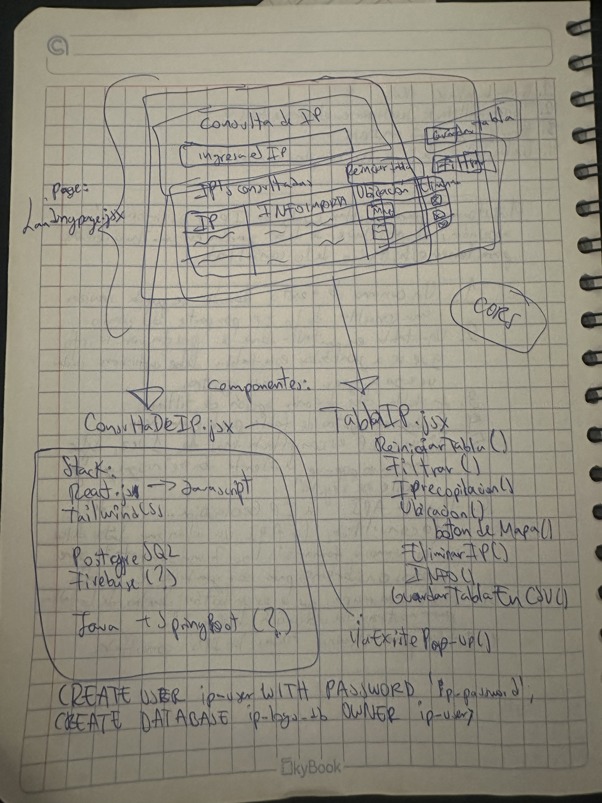
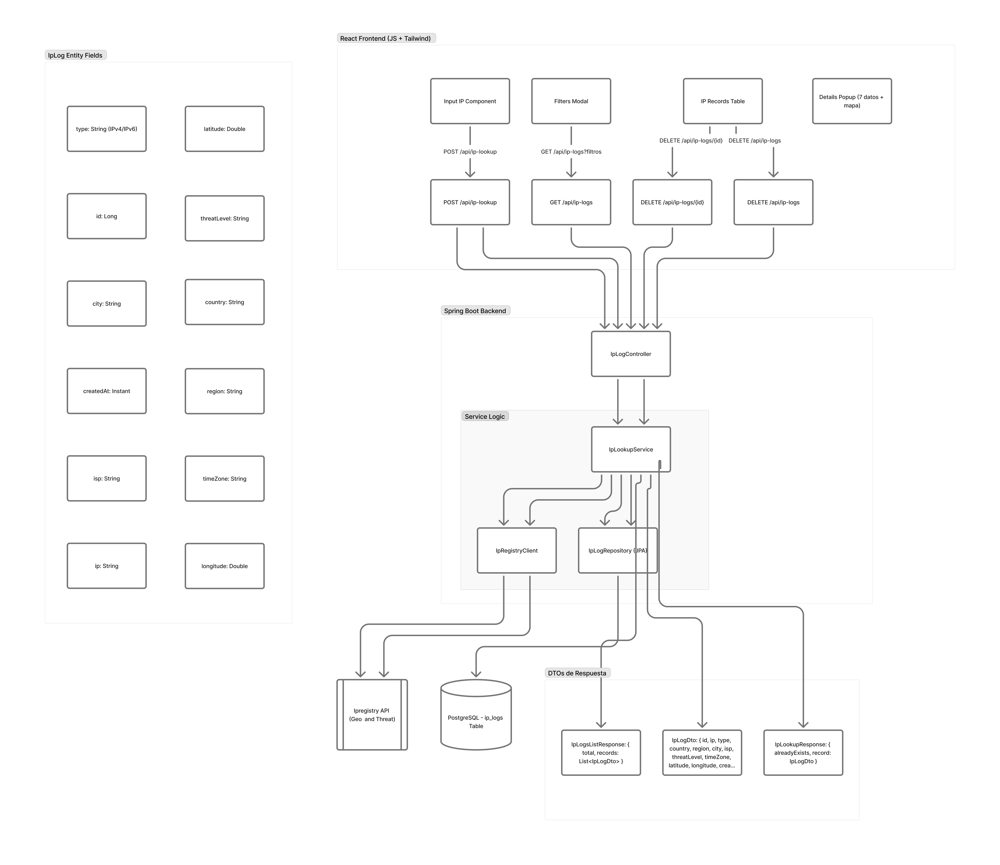
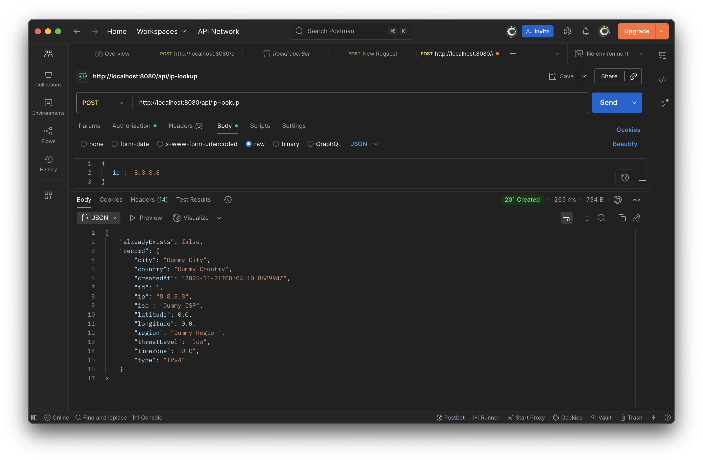

# Consulta IP – Backend

Este es el backend. Lo construí con Java + Spring Boot y PostgreSQL. Su función es recibir una dirección IP, consultar una API externa de geolocalización y riesgo, guardar la información en una base de datos y exponer endpoints REST para que el frontend pueda consumirlos.

---

## 1. Objetivo del proyecto

Mi objetivo con el backend fue:

- Recibir direcciones IP enviadas desde el frontend.
- Consultar una API externa para obtener país, región, ciudad, ISP, coordenadas, zona horaria y nivel de riesgo.
- Guardar cada registro en PostgreSQL para no repetir consultas innecesarias.
- Exponer endpoints REST para listar, crear y eliminar registros de IP.

---

## 2. Diseño inicial y decisiones

Antes de escribir código, decidí organizar el proyecto de forma visual.

1. **Boceto en libreta**  
   Primero dibujé la interfaz del proyecto en una libreta. Ahí definí:
    - Qué datos iba a mostrar.
    - Qué stack iba a usar.
    - La query para crear el usuario y contraseña en mi base de datos local (ip_user / ip_password).
   
    

2. **Diseño simple en Figma**  
   Después hice un diseño muy sencillo en Figma para visualizar mejor la interfaz.

   

3. **Diagrama de flujo**  
   Luego hice un diagrama de flujo para entender el recorrido completo:
    - El frontend envía una IP.
    - El backend revisa si ya existe en la base.
    - Si no existe, consulto la API externa.
    - Guardo los datos y devuelvo la respuesta al frontend.
  
   
---

## 3. API externa: pruebas y decisión final

Inicialmente intenté usar la API que el reto proporcionaba.  
Lo primero que hice fue:

- Añadir sus keys en mis variables de entorno.
- Leer su documentación.
- Probar las llamadas a la API con Postman.



Al intentar probarla, descubrí que para poder usar muchas funciones, herramientas de test y endpoints, tenía que pagar una suscripción, y el plan gratuito realmente no permitía lo que necesitaba para este proyecto.

Por esa razón investigué alternativas y encontré una API pública gratuita de geolocalización y análisis de IPs que sí permitía hacer todas las pruebas necesarias, sin restricciones, y que me daba exactamente los datos que necesitaba.

Con eso pude continuar sin tener que adquirir ningún plan de pago.

---

## 4. Stack utilizado

- Java
- Spring Boot
- Spring Web
- Spring Data JPA
- PostgreSQL
- Lombok para reducir codigo
- Gradle
- Railway para deploy

---

## 5. Arquitectura

El backend está organizado con una arquitectura en capas:

- **controller**: expone endpoints REST.
- **service**: contiene toda la lógica de negocio.
- **repository**: interacción con la base de datos usando JPA.
- **model/entity**: definición de la tabla que conecta con Postgres.
- **config**: configuración de CORS y perfiles (dev,local,prod).

---

## 6. Entidad IpLog

La entidad representa cada IP registrada en la base. Contiene campos como:

- id
- ip
- type (IPv4 / IPv6)
- country
- region
- city
- isp
- latitude
- longitude
- threatLevel
- timeZone
- createdAt

Utilicé Lombok para evitar escribir setters, getters y constructores repetitivos.

---

## 7. Repositorio

Creé un repositorio que extiende JpaRepository.  
Incluye un método clave: `findByIp(String ip)`.

Este método permite verificar si una IP ya existe antes de llamar a la API externa.

---

## 8. Servicio

El service se encarga de:

- Verificar si la IP ya existe en la base.
- Si no existe:
    - Llamar a la API externa.
    - Mapear la respuesta.
    - Guardar el registro.
- Si sí existe:
    - Devolver el registro existente con una bandera alreadyExists.
- Listar todas las IPs.
- Eliminar una IP por id.

---

## 9. Controller

Los endpoints principales son:

- GET /api/ip-logs
- POST /api/ip-logs
- DELETE /api/ip-logs/{id}

---

## 10. Configuración de entornos

Separé los perfiles local y producción usando archivos application:

- application.yml
- application-local.yml
- application-prod.yml

Para producción utilizo variables de entorno de Railway, como:

- DB_HOST
- DB_PORT
- DB_NAME
- DB_USER
- DB_PASS

En local creé la BD manualmente ingresando a Postgres esta query:

```sql
CREATE USER ip_user WITH PASSWORD 'ip_password';
CREATE DATABASE ip_db OWNER ip_user;
GRANT ALL PRIVILEGES ON DATABASE ip_db TO ip_user;
